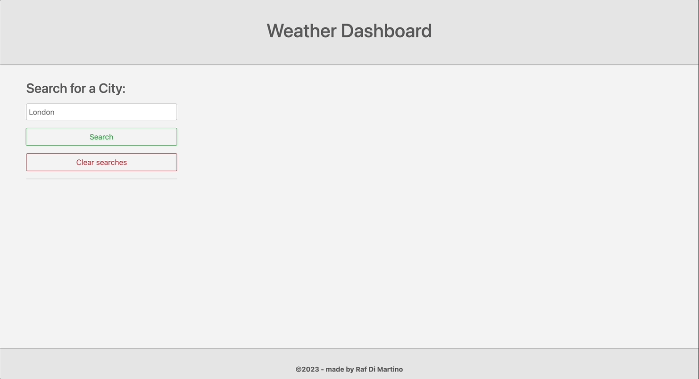

# Server-Side APIs: Weather Dashboard

## Description

In this assignement I had to to build a weather dashboard that runs in the browser and feature dynamically updated HTML and CSS.
The key elements in this application were to use the [Open Weather API](https://openweathermap.org/), used to retrieve the the weather five days forecast and use `localStorage` to make searches persistent on browser refresh.

The acceptance criteria for this exercise were as follow:

* Create a weather dashboard with form inputs.
  * When a user searches for a city they are presented with current and future conditions for that city and that city is added to the search history
  * When a user views the current weather conditions for that city they are presented with:
    * The city name
    * The date
    * An icon representation of weather conditions
    * The temperature
    * The humidity
    * The wind speed
  * When a user view future weather conditions for that city they are presented with a 5-day forecast that displays:
    * The date
    * An icon representation of weather conditions
    * The temperature
    * The humidity
  * When a user click on a city in the search history they are again presented with current and future conditions for that city

### Link to the deployed application 
https://rafdimartino.github.io/module-8-challenge-weather-dashboard/

## Installation
N/A

## Usage

The following animation shows the web application's appearance and functionalities:

## Credits
N/A

## License
Please refer to the LICENSE in the repo.
